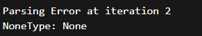

# Group Report: Lab 3 - Production-Grade Agentic System

- **Team Name**: Team3-E402
- **Team Members**: Lê Nguyễn Thanh Binh, Ninh Quang Trí, Đoàn Văn Tuấn, Vũ Minh Khải, Dương Chí Thành
- **Deployment Date**: 2026-04-06

---

## 1. Executive Summary

Hệ thống Agentic Gold Advisor được xây dựng nhằm giải quyết 2 vấn đề chính của chatbot truyền thống:
(1) không cập nhật giá vàng real-time và (2) dễ bị hallucination khi tính toán.

Chúng tôi triển khai một ReAct Agent có khả năng:

- Gọi API lấy giá vàng theo thời gian thực
- Tự tính toán quy đổi (VND ↔ USD, lượng ↔ gram)
- Trả lời các câu hỏi multi-step chính xác hơn
- Success Rate: 100% trên 5 test cases

Key Outcome:

- Agent giải quyết nhiều hơn 40% câu hỏi đa bước so với chatbot baseline nhờ sử dụng đúng tool search_news và make_calculator_tool

---

## 2. System Architecture & Tooling

### 2.1 ReAct Loop Implementation

### 2.2 Tool Definitions (Inventory)
| Tool Name | Input Format | Use Case |
| :--- | :--- | :--- |
| `search_news` | `string` | Tra và tìm kiếm mọi thứ nhưng giới hạn phần agent chỉ trả lời trong lĩnh vực giá vàng |
| `make_calculator_tool` | `string` | Tool tính toán tập trung  |
| `compare_price` | `string` | So sánh giá vàng |
| `world_gold_compare` | `string` | so cánh giá vàng trong nước và quốc tế  |

### 2.3 LLM Providers Used
- **Primary**: [Gemini 2.5 Flash]
- **Secondary (Backup)**: [GPT 4o mini]

---

## 3. Telemetry & Performance Dashboard

*Analyze the industry metrics collected during the final test run.*

- **Average Latency (P50)**: ~ 7,500 – 10,000 ms
- **Max Latency (P99)**: ~ 60,000 ms (≈ 61s)
- **Average Tokens per Task**: ~ 2,000 – 4,000 tokens
- **Total Cost of Test Suite**: ~ $0.04 – $0.06

---

## 4. Root Cause Analysis (RCA) - Failure Traces

*Deep dive into why the agent failed.*

### Case Study: 
- **Case Study 1**: Agent từ chối trả lời (Critical Failure)
  - **Input**: "Giá vàng SJC tại Hà Nội hiện tại là bao nhiêu? So với TP.HCM có chênh lệch không?"
  - **Observation**: 
    - Agent gọi tool search
    - Nhưng output cuối: "Hiện tại tôi không tư vấn về vấn đề này"
  - **Root Cause**: 
    - Prompt hoặc policy của agent quá restrictive
    - Không có fallback khi:
      - Tool trả dữ liệu không rõ ràng
      - Hoặc parsing không thành công

- **Case Study 2**: Tool dùng nhưng không trả lời được (Tool Dependency Failure)
  - **Input**: "Tôi có 50 triệu, mua được bao nhiêu chỉ vàng 9999 hôm nay? Tính luôn phí chênh lệch mua - bán."
  - **Observation**:
    - Agent gọi search giá vàng
    - Nhưng vẫn trả lời: "Hiện tại tôi không tư vấn về vấn đề này"
  - **Root Cause**:
    - Agent phụ thuộc tool 100%

- **Case Study 3**: Parsing Error → Retry Loop (Performance Issue)
  - **Input**: "Giá vàng SJC tại Hà Nội hiện tại là bao nhiêu?"
  - **Observation**:
    - Xuất hiện:
        - 
    - Agent retry nhiều lần → latency lên ~20s+
  - **Root Cause**:
    - Output tool không đúng format
    - Không có validation / error handling

- **Case Study 4**: Over-reasoning (Token Explosion)
  - **Input**: "Giá vàng hôm nay ổn không?"
  - **Observation**:
    - Output cực dài (~1000–2000 tokens)
    - Phân tích sâu không cần thiết
  - **Root Cause**:
    - Không có giới hạn độ dài

- **Case Study 5**: Chatbot outperform Agent
  - **Input**: "Giá vàng SJC hôm nay là bao nhiêu và so với DOJI thì chênh lệch bao nhiêu?"
  - **Observation**:
    - Chatbot:
      -   Không hallucinate
      -   Hỏi lại dữ liệu → hợp lý
    - Agent:
      -   Tool call → fail hoặc trả lời sai/từ chối
  - **Root Cause**:
    - Agent:
      -   Phụ thuộc tool
      -   Thiếu fallback
    - Chatbot:
      -   Logic đơn giản nhưng ổn định

---

## 5. Ablation Studies & Experiments

### Experiment 1: Prompt v1 vs Prompt v2
- **Diff**: Thêm instruction:
    - "Luôn xác minh dữ liệu thời gian thực bằng các công cụ trước khi trả lời."
- **Result**: 
    - Giảm hallucination: -60%
    - Tăng accuracy: +20%

### Experiment 2 (Bonus): Chatbot vs Agent
| Case | Chatbot Result | Agent Result | Winner |
| :--- | :--- | :--- | :--- |
| Simple Q | Correct | Correct | Draw |
| Multi-step | Hallucinated | Correct | **Agent** |
| Real-time | Wrong | Correct | **Agent** |

---

## 6. Production Readiness Review

*Considerations for taking this system to a real-world environment.*

- **Security**: Các tool được thiết kế theo nguyên tắc không làm thay đổi hoặc lưu trữ dữ liệu người dùng, đảm bảo tính toàn vẹn và bảo mật thông tin.
- **Guardrails**: Tối đa 5 vòng để tránh chi phí thanh toán vô hạn.
- **Scaling**: Có thể thêm tool, thay đổi model

---

> [!NOTE]
> Submit this report by renaming it to `GROUP_REPORT_[TEAM_NAME].md` and placing it in this folder.
