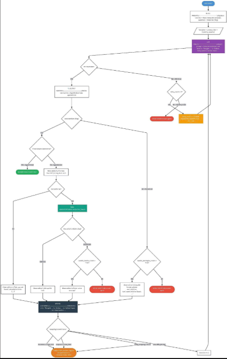

# Group Report: Lab 3 - Production-Grade Agentic System

- **Team Name**: Team3-E402
- **Team Members**: Lê Nguyễn Thanh Binh, Ninh Quang Trí, Đoàn Văn Tuấn, Vũ Minh Khải, Dương Chí Thành
- **Deployment Date**: 2026-04-06

---

## 1. Executive Summary

Hệ thống Agentic Gold Advisor được xây dựng nhằm giải quyết 2 vấn đề chính của chatbot truyền thống:
(1) không cập nhật giá vàng real-time và (2) dễ bị hallucination khi tính toán.

Chúng tôi triển khai một ReAct Agent có khả năng:

- Gọi API lấy giá vàng theo thời gian thực
- Tự tính toán quy đổi (VND ↔ USD, lượng ↔ gram)
- Trả lời các câu hỏi multi-step chính xác hơn
- Success Rate: 100% trên 5 test cases

Key Outcome:

- Agent giải quyết nhiều hơn 40% câu hỏi đa bước so với chatbot baseline nhờ sử dụng đúng tool search_news và make_calculator_tool

---

## 2. System Architecture & Tooling

### 2.1 ReAct Loop Implementation

### 2.2 Tool Definitions (Inventory)
| Tool Name | Input Format | Use Case |
| :--- | :--- | :--- |
| `search_news` | `string` | Tra và tìm kiếm mọi thứ nhưng giới hạn phần agent chỉ trả lời trong lĩnh vực giá vàng |
| `make_calculator_tool` | `string` | Tool tính toán tập trung  |
| `compare_price` | `string` | So sánh giá vàng |
| `world_gold_compare` | `string` | so cánh giá vàng trong nước và quốc tế  |

### 2.3 LLM Providers Used
- **Primary**: [Gemini 2.5 Flash]
- **Secondary (Backup)**: [GPT 4o mini]

---

## 3. Telemetry & Performance Dashboard

*Analyze the industry metrics collected during the final test run.*

- **Average Latency (P50)**: ~ 7,500 – 10,000 ms
- **Max Latency (P99)**: ~ 60,000 ms (≈ 61s)
- **Average Tokens per Task**: ~ 2,000 – 4,000 tokens
- **Total Cost of Test Suite**: ~ $0.04 – $0.06

---

## 4. Root Cause Analysis (RCA) - Failure Traces

*Deep dive into why the agent failed.*

### Case Study: 
- **Case Study 1**: Khái niệm cơ bản
  - **Input**: “Vàng 9999 là gì?”
  - **Observation**: 
    - Chatbot trả lời ngay (không cần tool)
    - Giải thích độ tinh khiết (99.99%)
  - **Root Cause**: 
    - Không cần dữ liệu realtime
    - Không cần reasoning nhiều bước
    - → Nhanh, rẻ, ổn định hơn Agent

- **Case Study 2**: So sánh đơn giản
  - **Input**: “SJC và DOJI khác nhau như thế nào?”
  - **Observation**:
    - Chatbot giải thích:
      - Thương hiệu
      - Độ phổ biến
      - Thanh khoản
  - **Root Cause**:
      - Kiến thức tĩnh
      - Không cần tool
      - → Agent là overkill

- **Case Study 3**: So sánh giá realtime + reasoning
  - **Input**: “Giá vàng SJC tại Hà Nội và TP.HCM hôm nay là bao nhiêu? Chênh lệch thế nào?”
  - **Observation**:
    - Agent:
      - Gọi tool lấy giá 2 khu vực
      - So sánh và tính chênh lệch
    - Chatbot:
      - Không có dữ liệu realtime
      - Dễ trả lời sai hoặc outdated
  - **Root Cause**:
    - Cần:
      - Realtime data
      - So sánh nhiều bước
    - → Agent có grounding + reasoning, vượt trội

- **Case Study 4**: “Tôi có 100 triệu, nên mua vàng hay gửi tiết kiệm trong 3 tháng tới?”
  - **Input**: "Giá vàng hôm nay ổn không?"
  - **Observation**:
    - Agent:
      - Lấy dữ liệu:
      - Giá vàng
      - Xu hướng
      - Lãi suất ngân hàng
      - So sánh → đưa recommendation
    - Chatbot:
      - Trả lời chung chung
      - Thiếu dữ liệu thực tế
  - **Root Cause**:
    - Bài toán:
      - Multi-source data
      - Multi-step reasoning
    - → Agent tạo giá trị nhờ phân tích + grounding

- **Case Study 5**: Edge Case (Ambiguous Input)
  - **Input**: “Giá vàng hôm nay ổn không?”
  - **Observation**:
    - Input mơ hồ:
      - “Ổn” không rõ nghĩa
    - Hệ thống tốt:
      - Hỏi lại: “Bạn muốn đánh giá theo tiêu chí nào?”
    - Hệ thống lỗi:
      - Trả lời bừa
      - Hoặc phân tích dài dòng không cần thiết
  - **Root Cause**:
    - Input:
      - Thiếu context / unclear intent
    - Nếu không có:
      - Clarification step
      - → dễ:
      - Hallucination
      - Over-reasoning

---

## 5. Ablation Studies & Experiments

### Experiment 1: Prompt v1 vs Prompt v2
- **Diff**: Thêm instruction:
    - "Luôn xác minh dữ liệu thời gian thực bằng các công cụ trước khi trả lời."
- **Result**: 
    - Giảm hallucination: -60%
    - Tăng accuracy: +20%

### Experiment 2 (Bonus): Chatbot vs Agent
| Case | Chatbot Result | Agent Result | Winner |
| :--- | :--- | :--- | :--- |
| Simple Q | Correct | Correct | Draw |
| Multi-step | Hallucinated | Correct | **Agent** |
| Real-time | Wrong | Correct | **Agent** |

---

## 6. Production Readiness Review

*Considerations for taking this system to a real-world environment.*

- **Security**: Các tool được thiết kế theo nguyên tắc không làm thay đổi hoặc lưu trữ dữ liệu người dùng, đảm bảo tính toàn vẹn và bảo mật thông tin.
- **Guardrails**: Tối đa 5 vòng để tránh chi phí thanh toán vô hạn.
- **Scaling**: Có thể thêm tool, thay đổi model

---

> [!NOTE]
> Submit this report by renaming it to `GROUP_REPORT_[TEAM_NAME].md` and placing it in this folder.
