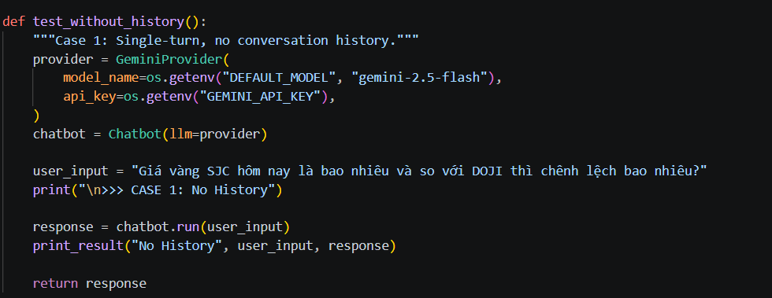
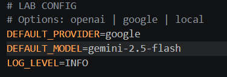

# Individual Report: Lab 3 - Chatbot vs ReAct Agent

- **Student Name**: Lê Nguyễn Thanh Bình
- **Student ID**: 2A202600447
- **Date**: 2026-06-04

---

## I. Technical Contribution (15 Points)

Trong project này, mình chủ yếu đảm nhận vai trò tester và hỗ trợ debug, đồng thời xây dựng các test case để kiểm tra độ ổn định của hệ thống Agent.

Modules Implemented:
    - src/tests/test_chatbot.py

---

## II. Debugging Case Study (10 Points)

*Analyze a specific failure event you encountered during the lab using the logging system.*

- **Problem Description**: Trong quá trình kiểm thử, hệ thống đôi khi trả về lỗi liên quan đến model không hợp lệ khi gọi API, khiến chatbot không thể phản hồi.
- **Log Source**: Dựa trên test case trong file test_chatbot.py, hệ thống được khởi tạo như sau:
    - provider = GeminiProvider(
    model_name=os.getenv("DEFAULT_MODEL", "gemini-2.5-flash"),
    api_key=os.getenv("GEMINI_API_KEY"),
)
    - Sau đó gọi: 
      - response = chatbot.run(user_input)
- **Diagnosis**: 
    - Model được lấy từ biến môi trường DEFAULT_MODEL
    - Nếu không có thì mặc định là "gemini-2.5-flash"
    - Hệ thống bị lỗi do: .env chứa giá trị khác 
- **Solution**: 
  - Kiểm tra và sửa lại file .env
    
  - Đảm bảo tất cả test case đều dùng đúng provider (Gemini)

---

## III. Personal Insights: Chatbot vs ReAct (10 Points)

*Reflect on the reasoning capability difference.*

1.  **Reasoning**: Theo em, điểm khác biệt lớn nhất là ReAct Agent có bước Thought, giúp model suy nghĩ từng bước thay vì trả lời ngay.
2.  **Reliability**: Một số trường hợp Agent hoạt động kém hơn:
- Khi tool bị lỗi (API không trả dữ liệu)
- Khi cấu hình sai (ví dụ sai model như em gặp)
1.  **Observation**: Observation (kết quả từ tool) ảnh hưởng rất lớn đến hành vi của agent.
- Nếu observation đúng:
  - Agent sẽ đưa ra câu trả lời chính xác
- Nếu observation sai hoặc thiếu:
  - Agent sẽ suy luận sai theo

---

## IV. Future Improvements (5 Points)

*How would you scale this for a production-level AI agent system?*

- **Scalability**: Xây dựng hệ thống test tự động để kiểm tra agent với nhiều test case hơn.
- **Safety**: Có thể thêm một bước kiểm tra output trước khi trả về cho user
- **Performance**: Cache các câu hỏi phổ biến để giảm thời gian phản hồi

---

> [!NOTE]
> Submit this report by renaming it to `REPORT_[YOUR_NAME].md` and placing it in this folder.
